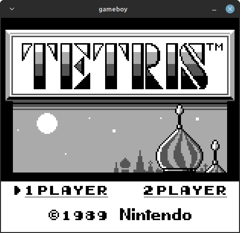
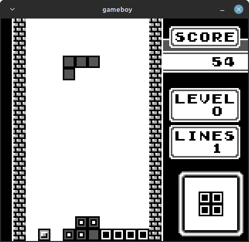

# Gameboy Emulator

### Description
  - Work in progress.
  - A Gameboy emulator written in c.
  - Currently passes all individual [blaggr](https://github.com/retrio/gb-test-roms) `cpu_instrs` tests and games without memory bank controller (MBC) are playable.

### TODO
  - Memory bank switching.
  - Sound.

### References
  - [Pandocs](https://gbdev.io/pandocs/)
  - [CPU opcode table](https://izik1.github.io/gbops/)
  - [CPU opcode descriptions](https://rgbds.gbdev.io/docs/v0.5.1/gbz80.7)
  - [The Gameboy Emulator Development Guide](https://hacktixme.ga/GBEDG/)
  - Emu dev Discord: Thank you for all the help debugging my countless bugs

### Requirments
  - Unix based OS.
  - gcc compiler.
  - [SDL2](https://www.libsdl.org/)

### Controls
| Keyboard | Gameboy |
| -------- | --------|
| W        | Up      |
| A        | Left    |
| S        | Down    |
| D        | Right   |
| O        | B       |
| P        | A       |
| K        | select  |
| L        | start   |

### Images

|   |   |
|:---:|:---:|
|  |  |
| Nintendo's boot sequence | Tetris menu |
|  |  |
| Tetris gameplay | Dr. Mario |
