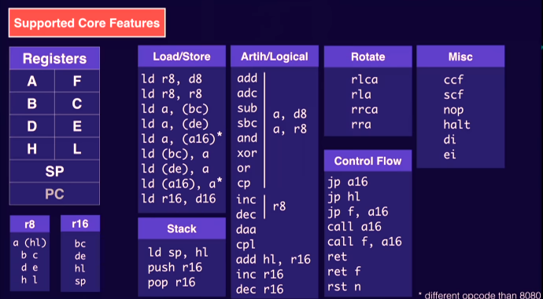
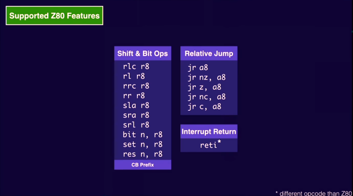
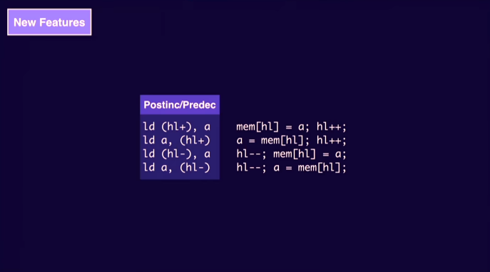
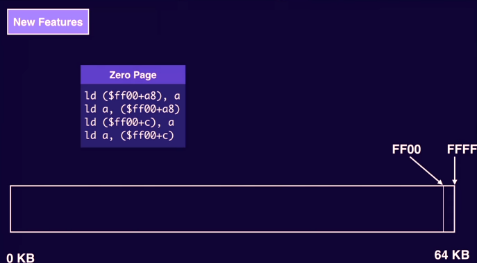
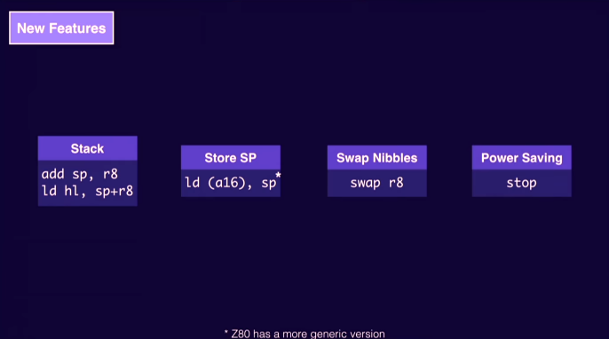

**specs**
- cpu: 1Mhz* 8bit
- ram: 8kb
- vram: 8kb
- res: 160*144
- simultaneous colors: 4
- sprites/line: 10

**architecture - DMG-CPU (SoC)**
- CPU
- Interrupt Controller
- Timer
- Memory
- Boot ROM
- Joypad input
- Serial Data Transfer
- Sound Controller
- PPU (Pixel Processing Unit)

**CPU**
Intel 8080 + Zilog Z80.

- Supported Core Features:  

- Z80 Features:  

- New Features:  

**Timers**
- CPU: 4 Mhz
- RAM: 1 Mhz
- PPU: 4 Mhz
- VRAM: 2 Mhz

**Memory**
62 Kb address space
- 0x0000 ROM (with possibly multiple ROM bannks -> usualy first half is bank 0, second half bank 1-n)
    - 0x0000 - 0x00FF BOOT ROM: CPU starts running at address 0x0000 showing nintendo logo
    - 0x0100 - ? ROM header including nintendo logo to compare to BOOT ROM
- 0x8000 VRAM
- 0xA000 External ram (save games for example, multiple external rams can be mounted)
- 0xC000 RAM
- 0xFE00 OAM RAM
- 0xFF00 I/O
- 0xFF80 HRAM

**PPU**
- 12 registers
- 160*144 pixels (4 colors)
- 8\*8 tile based
- tile data: 256 tiles

- background layer
    - 20\*18 tiles (8*8)
    - scrolling -> moving viewport
    - tile data: 256 tiles

- window layer (on top of background)
    - fixed (no scrolling)

- sprites / objects
    - tile data: 256 tiles
    - max 40 sprites on the screen (and max 10 per line)
    - every sprite is associated to a 8*8 tile
    - sprites can have translucency
    - every sprite has attributes -> OAM (Object Attribute Map) entry (Contains pos_x, pox_y, tile_num, priority, flip_x, flip_y, pallete)
    - special mode (global) for 8*16 pixel sprites

- vram
    - 1Kb Window Map 32*32 indexes
    - 1Kb Back Ground Map 32*32 indexes
    - 4Kb Back Ground tiles (256 * 16bytes)
    - 4Kb Sprite tiles (256 * 16bytes)
    - There is actually overlapping between these memory locations. There are special bits (registers?) to control their positioning.

- vertical timining
    - screen draws pixels left to right top to bottom 60 times/sec
    - registers to check which line is being drawn (lyc). Allows for interrupts when line is reached. This allows for drawing different horizontal sections of the screen in different ways (example activate/deactivate scrolling or window drawing).

- PPU timing
    - For each line (144 lines in total) horizontal timing
        - OAM Search: 20 clocks
        - pixel transfer 43 clocks
        - H-Blank 51 clocks (idle)

    - vertical timing
        - 144 * horizontal timing lines
        - V-Blank 10 lines

    - flags to know in which ppu timing section the ppu is. Trigger interrupts for these sections

- RAM / VRAM Access
    - CPU connected to RAM
    - PPU connected to VRAM and OAM RAM
    - CPU needs to go through PPU to write to VRAM and OAM RAM
    - PPU has a switch to allow/prohibit CPU from accessing VRAM
    - CPU cannot access VRAM during pixel transfer
    - CPU cannot access OAM RAM during pixel transfer and OAM search

- Pixel Pipeline
    - Pixel FIFO buffer that shifts out pixels to the LCD at 4Mhz
    - The Pixel FIFO needs to have more than 8 pixels to be able to shift pixels out
    - Pixel fetcher fetches 16 bits from the background map (2 cycles, 2*8bits) constructing 8 new pixels and places them in the right side of the FIFO -> left side can start to shift pixels out
    - FIFO 4Mhz Fetch 2Mhz
    - sprites ...
    - window ...
